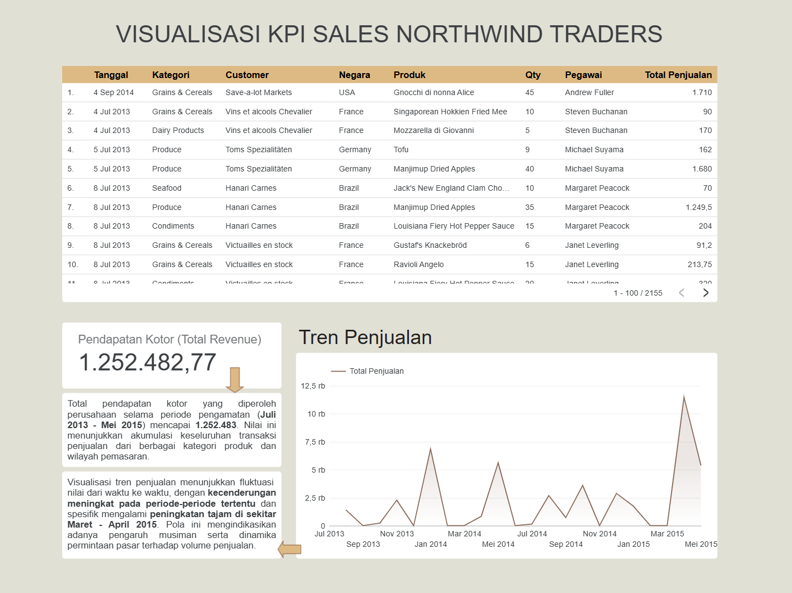
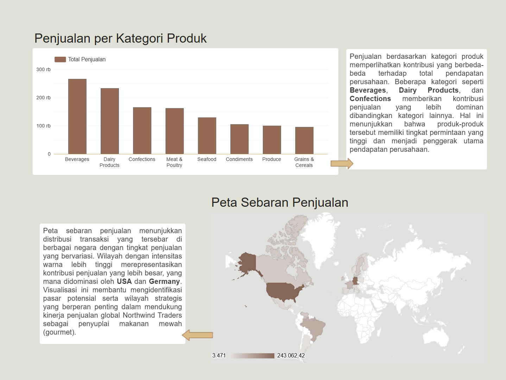

# 📊 FIVIZ - Analisis Business Intelligence: Northwind Traders Sales

<div align="center">

> **Tugas Akhir — Proyek ETL & Visualisasi Data**
> *Analisis Business Intelligence untuk mengevaluasi kinerja penjualan, dan tren produk pada Northwind Traders.*
> **Sumber Data:** Dataset Northwind Traders (Kaggle)
> 

---

</div>

## Meet Our Team

| Dimas Adi Bayu Samudra | Dwi Ahmad Khairy | Adinda Mirza Devani | Riovaldo Alfiyan Fahmi Rahman | Zilan Zalilan |
|:-------------------:|:---------------:|:--------------:|:--------------------:|:--------------------:|
|  |  |  |  |  |
| 2341720169 | 2341720073 | 2341720046 | 2341720209 | 244107023003 |


## 📌 Tentang Proyek

Proyek ini bertujuan membangun sistem **Business Intelligence (BI)** yang komprehensif untuk perusahaan fiktif **Northwind Traders**. Fokus utama adalah mengolah data transaksi mentah menjadi **insight bisnis yang bernilai** melalui proses **Extract, Transform, Load (ETL)** serta penyajian **visualisasi data interaktif**.

Sistem BI ini dirancang untuk menjawab beberapa pertanyaan bisnis strategis berikut:

* Bagaimana tren pendapatan perusahaan dari waktu ke waktu?
* Produk dan kategori apa yang menjadi penyumbang pendapatan terbesar?
* Bagaimana performa penjualan berdasarkan peta persebaran negara di dunia?

---

## 🏗️ Arsitektur & Teknologi

Proyek ini menerapkan pendekatan **Star Schema** dalam pembangunan **Data Warehouse**, dengan teknologi sebagai berikut:

* **ETL Tool:** Pentaho Data Integration (PDI / Kettle)
* **Database:** MySQL / MariaDB (Data Warehouse)
* **Visualisasi:** Looker Studio / BI Dashboard Tools
* **Sumber Data:** Dataset Northwind Traders (CSV / Excel)

### 🔄 Alur Kerja Data (Pipeline ETL)

1. **Extract**
   Mengambil data mentah dari file sumber (CSV).
2. **Transform**
   Membersihkan data, menyesuaikan tipe data, serta melakukan denormalisasi untuk membentuk tabel **Dimensi (Dimensions)** dan **Fakta (Facts)**.
3. **Load**
   Memuat data hasil transformasi ke dalam Data Warehouse.
4. **Visualize**
   Menyajikan data dalam bentuk dashboard interaktif untuk analisis bisnis.

---

## 📈 Hasil Visualisasi (Dashboard)

Berikut adalah hasil visualisasi data yang dikembangkan untuk memantau **Key Performance Indicators (KPI)** utama perusahaan.

### 🧩 Halaman 1: Ringkasan Eksekutif & KPI Utama

Menampilkan metrik utama seperti **Total Pendapatan**, **Volume Penjualan**, serta **tren penjualan dari waktu ke waktu**.



---

### 🌍 Halaman 2: Analisis Detail (Produk & Geografis)

Menampilkan analisis mendalam berdasarkan:

* Kategori Produk
* Negara Tujuan Penjualan



---

## 📁 Struktur Repositori

```text
├── Pentaho/                   # File Transformasi (.ktr) dan Job (.kjb) Pentaho
│   ├── DimCustomer_TA_BI.ktr  # Transformasi Dimensi Customer
│   ├── DimEmployee_TA_BI.ktr  # Transformasi Dimensi Employee
│   ├── DimProduct_TA_BI.ktr   # Transformasi Dimensi Product
│   ├── FactSales_TA_BI.ktr    # Transformasi Tabel Fakta Sales
│   └── uas_bi.kjb             # Main Job untuk menjalankan seluruh proses ETL
│
├── Visualisasi/               # Aset visualisasi dan laporan dashboard
│   ├── halaman1.png           # Screenshot Dashboard Halaman 1
│   ├── halaman2.png           # Screenshot Dashboard Halaman 2
│   └── *.pdf                  # Laporan visualisasi lengkap
│
├── data_visualisasi/          # Data hasil ETL siap analisis (CSV / XLSX)
├── uas_bi_dw.sql              # Skema Data Warehouse (DDL)
└── README.md                  # Dokumentasi Proyek
```

---

## ✅ Kesimpulan

Melalui proyek ini, sistem Business Intelligence berhasil dibangun untuk membantu pengambilan keputusan berbasis data pada Northwind Traders. Dashboard yang dihasilkan mampu menyajikan informasi penjualan secara ringkas, informatif, dan mudah dipahami oleh pemangku kepentingan.

---

> 📘 *Proyek ini dikembangkan sebagai bagian dari Tugas Akhir dengan fokus pada implementasi ETL, Data Warehouse, dan Visualisasi Data.*


